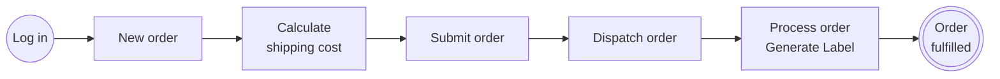
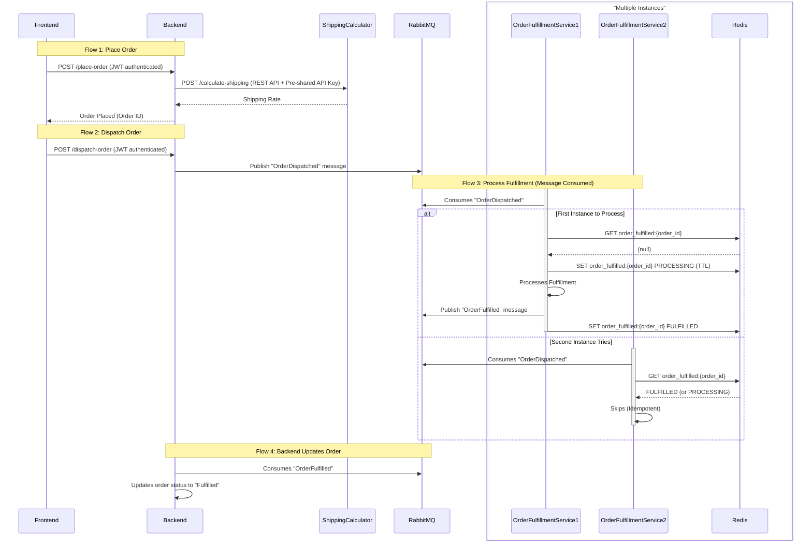

# Microservice web application PoC

Exploring how a traditionally monolithic PHP application could be taken apart into independent components.

The purpose of this repository is to showcase a running system. 
It provides Docker Compose instruction to launch the app components with supplementary services ([How to Run](#How-to-run)).   

## Logistics Hub
Imagine a real application scenario: an order fulfillment platform.<br/>
Clients (users) log in to their accounts and place orders.<br/>
Order shipping costs are dynamically calculated by each carrier (3rd party service).<br/>
Finally, the order has to be internally processed, a shipping label will be generated. 




## Architecture

### Backend ([logisticshub-poc-backend](https://github.com/Se-Ku/logisticshub-poc-backend))
The backend app holds all the business logic and exposes API endpoints to cover all use cases.<br/>
Also provides a message consumer worker to run as an independent service (receives information about fulfilled orders).

Tech stack: PHP, Symfony, API Platform, MySQL, RabbitMQ

### Frontend ([logisticshub-poc-frontend](https://github.com/Se-Ku/logisticshub-poc-frontend))
The frontend app only provides a GUI for the backend's API. There could be multiple GUIs or "clients" for the backend.<br/>

Tech stack: Nuxt (node.js + Vue.js), TypeScript

### Order fulfillment service ([logisticshub-poc-orderfulworker](https://github.com/Se-Ku/logisticshub-poc-orderfulworker))
Represents a resource intensive operation (i.e. PDF generation) that has been decoupled from the main
application.<br/>
Once the order is marked as ready for fulfillment, the backend delegates further processing to a dedicated service.<br/>
The backend and the service exchange messages through RabbitMQ, making the process truly asynchronous.

The fulfilment microservice is designed to run in multiple instances (to scale with actual traffic).<br/>
All instances share state through a Redis cache, so no order is processed more than once (or concurrently).

Tech stack: Node.js, TypeScript, RabbitMQ, Redis

### Shipping cost calculator ([logisticshub-poc-calcservice](https://github.com/Se-Ku/logisticshub-poc-calcservice))
Shipment calculator is there to mimic a real world 3rd party service with synchronous communication.<br/>
It exposes a REST endpoint that expects shipment data (i.e. package size) and returns calculated cost.

Tech stack: TypeScript, Fastify

## Flow diagram
A more detailed overview of order placement and fulfillment. <br/>
The user only interacts with the frontend.<br/>
The frontend only communicates with the backend (not the other services).<br/>

### Dynamic shipping cost calculator
While adding a new order, but before it is submitted, the user enters shipping information and has to calculate shipping costs. <br/>
For the purpose of demonstration, calculation requires manually pressing a button each time shipping data changes.<br/> 
The backend receives the calculation request and makes a (synchronous) call to external microservice (Shipping cost calculator), to finally return the result.

### Asynchronous order fulfillment
After adding an order, the user must mark it for fulfillment. The process is manual for the purpose of demonstration. <br/>
Pressing a button initiates call to the backend endpoint (order dispatch). <br/>
The backend sends a message to the Order fulfillment microservice, through RabbitMQ. <br/>
The microservice receives the message and, after (simulated) processing, sends a message back through the same channel.<br/>
Upon receiving the message, the backend marks the order as fulfilled.<br/>
Order status is refreshed by the frontend.<br/>




# How to run
Make sure to clone repository with submodules. <br/>
During 'compose up', docker will build images for every component (submodule) and run the system.
```bash
git clone --recursive https://github.com/Se-Ku/logisticshub-poc.git
cd logisticshub-poc.git
docker compose up
```  
After all services start, the application should be available at http://localhost:3000 . <br/>
Use the following credentials to log in: admin@admin.pl / admin.

